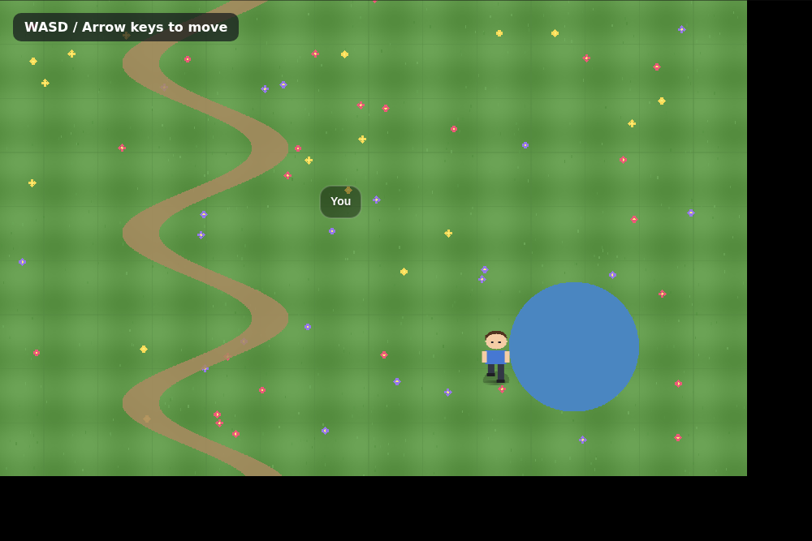

# Capybara engine — verified offline demo

A hand-authored, fully offline demo proving `d-liya/capybara_2d_engine` runs
end-to-end **without** the hosted asset pipeline (no API key / network needed):
a grass field + a 4-frame walk-cycle character driven with WASD / arrow keys,
with working camera-follow and hover labels.



Verified working: rendering, built-in keyboard movement, camera-follow, hover
tooltip. Typecheck (`npm run typecheck`) passes and the browser console is clean
(the only network errors are external CDN calls — Google Fonts, capybara.build
favicons, hosted SDK client — which are irrelevant to the engine itself).

## Files here

| File | What it is |
|---|---|
| `DemoScene.ts` | The scene. Builds an inline map + a player archetype, spawns it, and marks it controlled. No generated assets. |
| `genart.mjs` | Zero-dependency PNG generator (tiny built-in encoder). Paints `map.png` (1500×1000 grass field) and `player.png` (256×96, 4-frame walk strip). |
| `demo-screenshot.png` | Proof capture (character mid-walk toward the pond). |

## Reproduce in a fresh clone

```bash
git clone https://github.com/d-liya/capybara_2d_engine
cd capybara_2d_engine
npm install

# Fix the Tailwind v4 / lightningcss native binaries (see ../capybara-engine-overview.md).
# Install BOTH in ONE command or npm prunes the first. Match the installed versions.
npm install --no-save \
  lightningcss-linux-x64-gnu@1.32.0 \
  @tailwindcss/oxide-linux-x64-gnu@4.3.0

# Drop the demo in:
node /path/to/genart.mjs ./demo-assets          # writes demo-assets/{map,player}.png
cp /path/to/DemoScene.ts src/scenes/DemoScene.ts

# Wire it into src/main.ts: import { createDemoScene } and call it where the
# template comment says "Create and start the game scene here":
#   import { createDemoScene } from "./scenes/DemoScene";
#   createDemoScene({ onAudioReady: loadingGate.onContinue });

npm run dev     # http://localhost:3000  — click "Tap To Continue", then move with WASD
```

## What this demonstrates about the engine

- The public API really is small: the whole scene is `createGame()` +
  `defineArchetype()` + `spawnAtFeet()` + `setControlledEntity()`.
- Movement, camera, Y-sorting, and hover come for free from the runtime once an
  entity is marked controlled — you only supply art + coordinates.
- It's genuinely offline-capable; the hosted MCP/API key is only for *generating*
  assets, not for running the engine.
